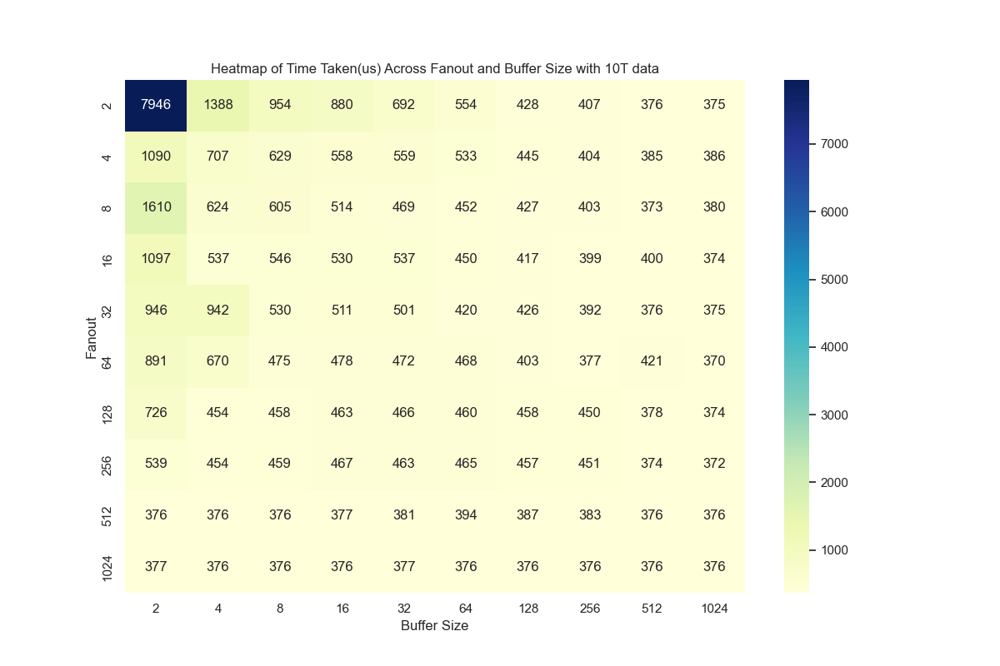

# NVM-Optimized Bϵ-Tree

## Overview
This repository implements an **NVM-Optimized Bϵ-Tree**, designed as an alternative index structure. The Bϵ-tree combines features from **B+-trees** and additonal buffers to provide a write-optimized index structure, particularly tuned for systems using **Non-Volatile Memory (NVM)**.

The goal of this work is to leverage NVM's **byte-addressability**, **low read latencies**, and **in-place updates** to reduce the number of write operations, enhance memory utilization, and improve performance over traditional disk-based index structures.

## Key Concepts

### Traditional Disk-Based Index Structures
- **B-tree**: A multi-level index structure used for secondary storage.
- **B+-tree**: Enhances the B-tree by increasing the branching factor, where internal nodes contain only keys and pivots, while values are stored in the leaf nodes. It is optimized for range queries.
- **LSM-tree**: A write-optimized structure that maintains data in multiple levels, moving data in chunks and performing writes to a **Level-0** structure in DRAM.

### NVM-Optimized Bϵ-Tree
- Introduces **internal node buffers** to make B+-trees more write-optimized.
- Leverages **Non-Volatile Memory (NVM)** for internal nodes, providing in-place updates, reducing tree balancing operations, and buffering small updates to reduce write amplification.

## Key Features

- **In-Place Updates in NVM**: The internal nodes stored in NVM support in-place updates for key additions and deletions, reducing the overhead of frequent node copying between memory layers.
- **Buffered Internal Nodes**: Nodes in DRAM have buffers to batch updates, which are then periodically flushed to NVM or other slower storage mediums like SSD.
- **Central Buffer in NVM**: For handling messages that do not require immediate propagation to the leaf nodes, improving write efficiency.
- **Hot/Cold Data Management**: Hot nodes are kept in DRAM, while cold nodes reside in NVM or slower storage mediums. This hybrid storage design improves access times for frequently used data.

## Tree Structure


## Tree Operations

### 1. **Point Queries**:
   - Internal nodes are distributed across DRAM, NVM, and SSD.
   - Hot nodes (frequently accessed Bϵ-tree nodes) reside in DRAM, while less-accessed nodes (B+-tree nodes) are in NVM.
   - Querying begins by searching in DRAM, followed by NVM, and finally SSD for cold nodes.

### 2. **Tree Building**:
   - Tree construction begins in DRAM, where nodes are buffered until they are flushed to NVM.
   - Internal nodes without pending updates are moved to NVM and converted to B+-tree nodes, optimizing memory usage.

### 3. **Update Scenario**:
   - Updates are buffered in DRAM until a threshold is reached, after which they are either written back to the appropriate storage or moved to a central buffer in NVM.
   - Nodes are dynamically moved between DRAM and NVM based on access patterns, utilizing a policy (e.g., 5 minutes for slow storage, 1 minute for NVM).

### 4. **Batching & Flushing**:
   - Messages (updates) for internal nodes are either buffered in DRAM or written directly to NVM.
   - When buffers reach a sufficient size, they are flushed down the tree to the respective leaf nodes or further storage layers.

## Memory Hierarchy & Use of NVM

- **NVM Characteristics**: Byte-addressable, with DRAM-like read latencies but slower write speeds. Using NVM for indexing allows for efficient in-place updates, but the system design aims to reduce unnecessary writes to NVM.
- **Hot/Cold Nodes**: The system maintains a multi-level hierarchy where hot nodes (frequently accessed) reside in DRAM, and colder nodes are kept in NVM or SSD for longer-term storage.

## Advantages of the NVM-Optimized Bϵ-Tree

- **Reduced Write Amplification**: By buffering updates and selectively flushing them to lower levels of storage, the system minimizes unnecessary writes, especially for small updates.
- **Improved Point Query Performance**: The strategic placement of hot nodes in DRAM and the use of NVM for internal nodes leads to faster point queries, as data is often found in a higher memory tier.
- **Efficient Memory Utilization**: The system balances the use of DRAM, NVM, and SSD, improving both read and write performance while avoiding costly node copying between tiers.
- **Reduced Fragmentation**: The structure minimizes fragmentation through in-place updates and careful memory management, which is particularly beneficial for random workloads.

## Use Cases

- **Write-Heavy Workloads**: The Bϵ-tree is designed for environments where frequent writes occur, as its structure is optimized to handle batch updates efficiently.
- **Mixed Workloads**: Works well in systems with a combination of read and write operations due to its adaptive memory hierarchy and buffering strategies.
- **Large-Scale Systems**: Ideal for systems managing large amounts of data distributed across different storage media, particularly where NVM is used as a middle tier between DRAM and slower storage.

# Performance




## Installation & Usage

1. Clone the repository:
   ```bash
   git clone https://github.com/nandhishtr/BepsilonTree.git
